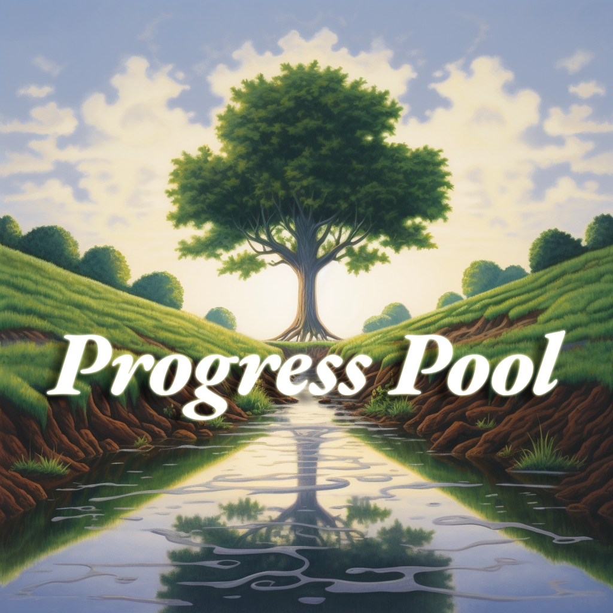

 

  
  <h3 align="center">Progress Pool</h3>
  

Most hackathon projects die. Progress Pool is a new funding mechanism that rewards those pursuing their projects beyond the hackathon weekend.
  

<a href="https://near.org/embed/ethpraguedemo.near/widget/Progress-Pool">Live Version</a>

## Example

- Organizers allocate a percentage of hackathon bounties (e.g., 10%) to a future pool
- After 90 days, participants submit proposals demonstrating project progress
- Evidence includes GitHub commits, Twitter marketing, etc.
- 30-day community voting period with tokens for all participants (hackers, speakers, organizers, sponsors)
- Approved proposals receive an equal percentage of the future pool
- Applicable beyond hackathons: grant programs, startup accelerators, open-source funding

## Tech Stack

- [Near BOS](https://docs.near.org/bos/overview)
- Smart Contracts

| Network   |      Contract      |       Address |
|----------|:-------------:|:------:|
| Optimism | [Token](https://optimistic.etherscan.io/address/0x28B857261EfDBAF9d395c8c5F5A0BE32f99c6abb) | 0x28B857261EfDBAF9d395c8c5F5A0BE32f99c6abb |
| Optimism | [Proposals](https://optimistic.etherscan.io/address/0xe98482dc01392a2f1236BCFE448EE3D26cf4e296)   | 0xe98482dc01392a2f1236BCFE448EE3D26cf4e296 |
| Optimism | [Treasury](https://optimistic.etherscan.io/address/0x8c04d05876d54914f4d3b066b884c0a2a66d40e3) | 0x8c04d05876d54914f4d3b066b884c0a2a66d40e3 |
| Scroll | [Treasury](https://blockscout.scroll.io/address/0x36929a7f45156130aC4072cA7cE79f7b08fD326d) | 0x36929a7f45156130aC4072cA7cE79f7b08fD326d |
| Mantle | [Token](https://explorer.testnet.mantle.xyz/address/0xD2029Fa7378Ab8d35200F6Fb0C4F203361dB0932) | 0xD2029Fa7378Ab8d35200F6Fb0C4F203361dB0932 |
| Mantle | [Proposal](https://explorer.testnet.mantle.xyz/address/0x6daA072A660814fa3c96961dfa11eee8A39a74b3) | 0x6daA072A660814fa3c96961dfa11eee8A39a74b3 |
- Hardhat
- Truffle Dashboard

The background image used in the logo was generated with the [Midjourney](https://www.midjourney.com/) text-to-image AI model. Prompt: progress pool for sustainable growth --v 5.1

